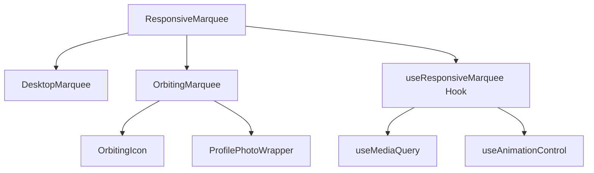
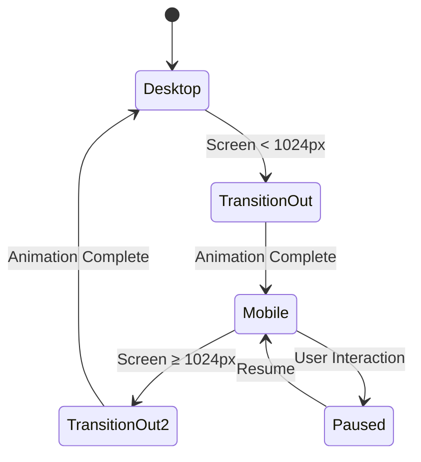
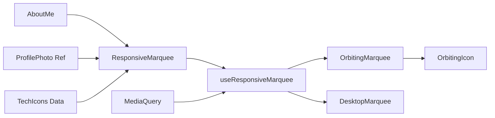

# Responsive Orbiting Marquee Design

## Overview

This design proposes implementing a responsive marquee component that adapts its behavior based on screen size. On desktop and larger screens, the marquee maintains its current horizontal scrolling behavior. On mobile and smaller screens (tablets and phones), the marquee transforms into an orbiting animation around the profile photo in the About Me section.

## Architecture

### Component Structure



### Technology Stack

- **React**: Component framework
- **TypeScript**: Type safety
- **Tailwind CSS**: Responsive utilities
- **CSS Animations**: Orbit mechanics
- **React Hooks**: State and lifecycle management

## Component Architecture

### ResponsiveMarquee Component

Main wrapper component that handles responsive behavior switching:

```typescript
interface ResponsiveMarqueeProps {
  techIcons: TechIcon[];
  profileElement?: HTMLElement;
  breakpoint?: number;
}

interface TechIcon {
  Icon: string;
  name: string;
  id: string;
}
```

**Responsibilities:**

- Detect screen size changes
- Switch between desktop and mobile modes
- Manage animation state transitions
- Coordinate with AboutMe component

### OrbitingMarquee Component

Handles the circular orbit animation around the profile photo:

```typescript
interface OrbitingMarqueeProps {
  techIcons: TechIcon[];
  centerElement: HTMLElement;
  radius: number;
  speed: number;
  direction: "clockwise" | "counterclockwise";
}
```

**Key Features:**

- Circular positioning calculation
- Smooth icon transitions
- Variable orbit speeds
- Collision detection
- Icon stacking management

### OrbitingIcon Component

Individual icon wrapper for orbit animation:

```typescript
interface OrbitingIconProps {
  icon: TechIcon;
  angle: number;
  radius: number;
  index: number;
  totalIcons: number;
}
```

## Responsive Behavior Strategy

### Breakpoint Detection

| Screen Size    | Behavior           | Implementation              |
| -------------- | ------------------ | --------------------------- |
| ≥ 1024px       | Horizontal Marquee | Current CSS animation       |
| 768px - 1023px | Compact Orbit      | Smaller radius, fewer icons |
| < 768px        | Mobile Orbit       | Optimized for touch screens |

### Animation Transitions



## Data Flow Architecture

### State Management

```typescript
interface MarqueeState {
  mode: "desktop" | "mobile" | "transitioning";
  isAnimating: boolean;
  orbitRadius: number;
  iconPositions: IconPosition[];
  animationSpeed: number;
}

interface IconPosition {
  iconId: string;
  angle: number;
  x: number;
  y: number;
  zIndex: number;
}
```

### Props Flow



## Styling Strategy

### CSS Custom Properties

```css
:root {
  --orbit-radius-mobile: 120px;
  --orbit-radius-tablet: 140px;
  --orbit-speed: 20s;
  --icon-size-mobile: 32px;
  --icon-size-desktop: 48px;
  --orbit-z-index: 10;
}
```

### Responsive Classes

| Class              | Purpose                   | Breakpoint  |
| ------------------ | ------------------------- | ----------- |
| `.marquee-desktop` | Desktop horizontal scroll | ≥ 1024px    |
| `.marquee-mobile`  | Mobile orbit container    | < 1024px    |
| `.orbit-container` | Orbit positioning context | Mobile only |
| `.orbit-icon`      | Individual orbiting icon  | Mobile only |

### Animation Keyframes

```css
@keyframes orbit-clockwise {
  from {
    transform: rotate(0deg) translateX(var(--orbit-radius)) rotate(0deg);
  }
  to {
    transform: rotate(360deg) translateX(var(--orbit-radius)) rotate(-360deg);
  }
}

@keyframes fade-transition {
  0% {
    opacity: 1;
    transform: scale(1);
  }
  50% {
    opacity: 0;
    transform: scale(0.8);
  }
  100% {
    opacity: 1;
    transform: scale(1);
  }
}
```

## Integration with AboutMe Component

### Profile Photo Enhancement

The profile photo container needs modification to support orbit positioning:

```typescript
interface ProfilePhotoProps {
  className?: string;
  enableOrbit?: boolean;
  orbitRadius?: number;
  children?: React.ReactNode;
}
```

### Layout Modifications

1. **Desktop Layout**: No changes to existing grid structure
2. **Mobile Layout**: Profile photo becomes orbit center with relative positioning
3. **Transition States**: Smooth fade between layouts

### Z-Index Management

| Layer           | Z-Index | Purpose                |
| --------------- | ------- | ---------------------- |
| Background      | 1       | About Me content       |
| Profile Photo   | 5       | Center reference point |
| Orbit Container | 10      | Orbit animation space  |
| Orbiting Icons  | 11-15   | Individual icon layers |
| Hover States    | 20      | Interactive feedback   |

## Performance Considerations

### Animation Optimization

- **CSS Transforms**: Use GPU-accelerated transforms for smooth animations
- **RequestAnimationFrame**: JavaScript calculations for complex positioning
- **Intersection Observer**: Pause animations when off-screen
- **Reduced Motion**: Respect user accessibility preferences

### Memory Management

- **Event Listeners**: Proper cleanup on component unmount
- **Animation Frames**: Cancel pending animations during transitions
- **Resize Handlers**: Debounced window resize events

## Accessibility Features

### Motion Preferences

```typescript
const respectsReducedMotion = useMediaQuery("(prefers-reduced-motion: reduce)");

// Fallback to static grid layout for reduced motion
if (respectsReducedMotion) {
  return <StaticTechGrid icons={techIcons} />;
}
```

### Screen Reader Support

- **ARIA Labels**: Descriptive labels for orbiting elements
- **Focus Management**: Keyboard navigation support
- **Alternative Content**: Text-based tech list for screen readers

### Keyboard Navigation

| Key         | Action            | Context                 |
| ----------- | ----------------- | ----------------------- |
| Tab         | Navigate icons    | Focus management        |
| Space/Enter | Pause/Resume      | Animation control       |
| Arrow Keys  | Manual navigation | Alternative interaction |

## Testing Strategy

### Unit Tests

1. **Component Rendering**: Correct mode switching based on screen size
2. **Animation States**: Proper state transitions
3. **Accessibility**: ARIA attributes and keyboard navigation
4. **Performance**: Animation frame cleanup

### Integration Tests

1. **Responsive Behavior**: Breakpoint switching
2. **AboutMe Integration**: Profile photo positioning
3. **Animation Synchronization**: Smooth transitions
4. **Error Handling**: Graceful degradation

### Visual Regression Tests

1. **Cross-Browser**: Animation consistency
2. **Device Testing**: Mobile orbit accuracy
3. **Performance**: Frame rate monitoring
4. **Accessibility**: High contrast and reduced motion modes
