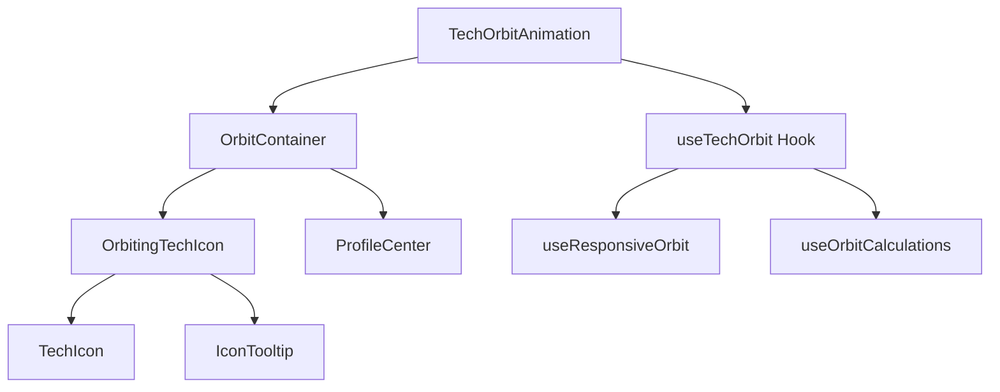

# Tech Orbit Animation Design

## Overview

This design implements a responsive technology orbit animation that displays all tech stack icons orbiting around the profile photo in the About Me section. Unlike the previous marquee implementation, this removes card containers and shows technologies as individual icons in continuous orbital motion.

## Architecture

### Component Structure



### Core Components

#### TechOrbitAnimation Component

Main orchestrator component that manages the entire orbit system:

```typescript
interface TechOrbitAnimationProps {
  techIcons: TechIcon[];
  profileRef: RefObject<HTMLElement>;
  className?: string;
  orbitConfig?: OrbitConfig;
}

interface TechIcon {
  Icon: React.ComponentType;
  name: string;
  id: string;
  color?: string;
}

interface OrbitConfig {
  radius: {
    mobile: number;
    tablet: number;
    desktop: number;
  };
  speed: number;
  direction: "clockwise" | "counterclockwise";
  iconSize: {
    mobile: number;
    tablet: number;
    desktop: number;
  };
}
```

#### OrbitingTechIcon Component

Individual technology icon wrapper with orbital positioning:

```typescript
interface OrbitingTechIconProps {
  techIcon: TechIcon;
  angle: number;
  radius: number;
  iconSize: number;
  animationDelay: number;
  index: number;
}
```

**Key Features:**

- Smooth circular movement
- Individual animation delays
- Hover interactions
- Responsive icon sizing
- Tooltip display on hover

## Technology Stack

- **React 19**: Component framework with latest features
- **TypeScript**: Type safety and interfaces
- **Tailwind CSS**: Utility-first styling and responsive design
- **Lucide React**: Icon library for tech stack icons
- **CSS Transforms**: GPU-accelerated animations
- **CSS Custom Properties**: Dynamic theming support

## Orbit Mechanics

### Positioning Calculations

```typescript
interface OrbitPosition {
  x: number;
  y: number;
  angle: number;
  transform: string;
}

const calculateOrbitPosition = (
  angle: number,
  radius: number,
  centerX: number,
  centerY: number
): OrbitPosition => {
  const radians = (angle * Math.PI) / 180;
  const x = centerX + radius * Math.cos(radians);
  const y = centerY + radius * Math.sin(radians);

  return {
    x,
    y,
    angle,
    transform: `translate(${x}px, ${y}px)`,
  };
};
```

### Animation Distribution

Technologies are evenly distributed around the orbit circle:

```typescript
const getIconDistribution = (totalIcons: number, startAngle: number = 0) => {
  const angleStep = 360 / totalIcons;
  return Array.from({ length: totalIcons }, (_, index) => ({
    angle: startAngle + index * angleStep,
    delay: index * 0.1, // Staggered animation start
  }));
};
```

## Responsive Behavior

### Breakpoint Configuration

| Screen Size             | Radius | Icon Size | Behavior                            |
| ----------------------- | ------ | --------- | ----------------------------------- |
| Mobile (< 768px)        | 100px  | 24px      | Compact orbit, essential techs only |
| Tablet (768px - 1023px) | 130px  | 32px      | Medium orbit, all techs             |
| Desktop (≥ 1024px)      | 160px  | 40px      | Full orbit, all techs with spacing  |

### Adaptive Tech Display

```typescript
const getResponsiveTechIcons = (
  allTechIcons: TechIcon[],
  screenSize: "mobile" | "tablet" | "desktop"
) => {
  switch (screenSize) {
    case "mobile":
      return allTechIcons.slice(0, 8); // Show only 8 most important
    case "tablet":
      return allTechIcons.slice(0, 12); // Show 12 technologies
    case "desktop":
      return allTechIcons; // Show all technologies
  }
};
```

## Styling Strategy

### CSS Custom Properties

```css
:root {
  /* Orbit Configuration */
  --orbit-radius-mobile: 100px;
  --orbit-radius-tablet: 130px;
  --orbit-radius-desktop: 160px;

  /* Icon Sizing */
  --icon-size-mobile: 24px;
  --icon-size-tablet: 32px;
  --icon-size-desktop: 40px;

  /* Animation */
  --orbit-duration: 30s;
  --orbit-timing: linear;

  /* Visual Effects */
  --icon-hover-scale: 1.2;
  --icon-shadow: 0 4px 12px rgba(0, 0, 0, 0.15);
  --tooltip-bg: var(--background);
  --tooltip-text: var(--foreground);
}
```

### Core Animation

```css
@keyframes orbit-rotation {
  from {
    transform: rotate(0deg);
  }
  to {
    transform: rotate(360deg);
  }
}

.orbit-container {
  position: absolute;
  top: 50%;
  left: 50%;
  transform: translate(-50%, -50%);
  animation: orbit-rotation var(--orbit-duration) var(--orbit-timing) infinite;
}

.orbit-icon {
  position: absolute;
  top: 50%;
  left: 50%;
  transform: translate(-50%, -50%) translateY(calc(var(--orbit-radius) * -1));
  transition: transform 0.3s ease;
}

.orbit-icon:hover {
  transform: translate(-50%, -50%) translateY(calc(var(--orbit-radius) * -1))
    scale(var(--icon-hover-scale));
}
```

### Icon-Specific Styling

```css
.tech-icon {
  width: var(--icon-size);
  height: var(--icon-size);
  border-radius: 50%;
  background: var(--background);
  border: 2px solid var(--border);
  display: flex;
  align-items: center;
  justify-content: center;
  box-shadow: var(--icon-shadow);
  transition: all 0.3s ease;
}

.tech-icon:hover {
  border-color: var(--primary);
  box-shadow: 0 6px 20px rgba(var(--primary-rgb), 0.3);
}
```

## Component Implementation

### TechOrbitAnimation

```typescript
export const TechOrbitAnimation: React.FC<TechOrbitAnimationProps> = ({
  techIcons,
  profileRef,
  className,
  orbitConfig = defaultOrbitConfig,
}) => {
  const { orbitRadius, iconSize, displayIcons } = useTechOrbit({
    techIcons,
    orbitConfig,
  });

  const iconDistribution = useMemo(
    () => getIconDistribution(displayIcons.length),
    [displayIcons.length]
  );

  return (
    <div className={cn("relative", className)}>
      <OrbitContainer radius={orbitRadius}>
        {displayIcons.map((techIcon, index) => (
          <OrbitingTechIcon
            key={techIcon.id}
            techIcon={techIcon}
            angle={iconDistribution[index].angle}
            radius={orbitRadius}
            iconSize={iconSize}
            animationDelay={iconDistribution[index].delay}
            index={index}
          />
        ))}
      </OrbitContainer>
    </div>
  );
};
```

### OrbitingTechIcon

```typescript
export const OrbitingTechIcon: React.FC<OrbitingTechIconProps> = ({
  techIcon,
  angle,
  radius,
  iconSize,
  animationDelay,
  index,
}) => {
  const [showTooltip, setShowTooltip] = useState(false);

  return (
    <div
      className="orbit-icon"
      style={
        {
          "--orbit-radius": `${radius}px`,
          "--icon-size": `${iconSize}px`,
          "--animation-delay": `${animationDelay}s`,
          transform: `rotate(${angle}deg) translateY(-${radius}px) rotate(-${angle}deg)`,
        } as CSSProperties
      }
      onMouseEnter={() => setShowTooltip(true)}
      onMouseLeave={() => setShowTooltip(false)}
    >
      <div className="tech-icon">
        <techIcon.Icon size={iconSize * 0.6} />
      </div>

      {showTooltip && <IconTooltip name={techIcon.name} />}
    </div>
  );
};
```

## Integration with AboutMe

### Profile Photo Positioning

The profile photo serves as the orbit center and needs specific positioning:

```typescript
interface ProfileCenterProps {
  children: React.ReactNode;
  className?: string;
  enableOrbit?: boolean;
}

export const ProfileCenter: React.FC<ProfileCenterProps> = ({
  children,
  className,
  enableOrbit = true,
}) => {
  return (
    <div
      className={cn("relative z-10", enableOrbit && "orbit-center", className)}
    >
      {children}
    </div>
  );
};
```

### Layout Modifications

```css
.about-me-section {
  position: relative;
  overflow: visible; /* Allow orbit to extend beyond container */
}

.profile-container {
  position: relative;
  z-index: 5;
}

.orbit-center {
  position: relative;
  z-index: 10;
}

.orbit-space {
  position: absolute;
  top: 0;
  left: 0;
  right: 0;
  bottom: 0;
  pointer-events: none; /* Allow interaction with underlying content */
  z-index: 1;
}
```

## Accessibility Features

### Motion Preferences

```typescript
const usePrefersReducedMotion = () => {
  const [prefersReducedMotion, setPrefersReducedMotion] = useState(false);

  useEffect(() => {
    const mediaQuery = window.matchMedia("(prefers-reduced-motion: reduce)");
    setPrefersReducedMotion(mediaQuery.matches);

    const handleChange = (event: MediaQueryListEvent) => {
      setPrefersReducedMotion(event.matches);
    };

    mediaQuery.addEventListener("change", handleChange);
    return () => mediaQuery.removeEventListener("change", handleChange);
  }, []);

  return prefersReducedMotion;
};
```

### Keyboard Navigation

```typescript
const OrbitingTechIcon: React.FC<OrbitingTechIconProps> = ({ ...props }) => {
  return (
    <div
      className="orbit-icon"
      tabIndex={0}
      role="button"
      aria-label={`${techIcon.name} technology`}
      onKeyDown={(e) => {
        if (e.key === "Enter" || e.key === " ") {
          setShowTooltip(!showTooltip);
        }
      }}
    >
      {/* Icon content */}
    </div>
  );
};
```

## Performance Optimizations

### Animation Performance

```css
.orbit-container,
.orbit-icon {
  will-change: transform;
  backface-visibility: hidden;
  transform-style: preserve-3d;
}

/* Use GPU acceleration */
.tech-icon {
  transform: translateZ(0);
}
```

### Intersection Observer

```typescript
const useOrbitVisibility = (containerRef: RefObject<HTMLElement>) => {
  const [isVisible, setIsVisible] = useState(false);

  useEffect(() => {
    const observer = new IntersectionObserver(
      ([entry]) => setIsVisible(entry.isIntersecting),
      { threshold: 0.1 }
    );

    if (containerRef.current) {
      observer.observe(containerRef.current);
    }

    return () => observer.disconnect();
  }, [containerRef]);

  return isVisible;
};
```

## Testing Strategy

### Component Testing

```typescript
describe("TechOrbitAnimation", () => {
  test("renders all technology icons in orbit", () => {
    render(
      <TechOrbitAnimation
        techIcons={mockTechIcons}
        profileRef={mockProfileRef}
      />
    );

    expect(screen.getAllByRole("button")).toHaveLength(mockTechIcons.length);
  });

  test("applies correct orbit radius based on screen size", () => {
    const { rerender } = render(
      <TechOrbitAnimation
        techIcons={mockTechIcons}
        profileRef={mockProfileRef}
      />
    );

    // Test mobile
    Object.defineProperty(window, "innerWidth", { value: 500 });
    window.dispatchEvent(new Event("resize"));

    // Verify mobile radius is applied
    expect(container.querySelector(".orbit-container")).toHaveStyle(
      "--orbit-radius: 100px"
    );
  });
});
```

### Visual Regression Testing

1. **Orbit Accuracy**: Verify consistent circular positioning
2. **Responsive Behavior**: Test radius and icon size adjustments
3. **Animation Smoothness**: Monitor frame rates and performance
4. **Theme Compatibility**: Test in light and dark modes
5. **Cross-Browser**: Ensure consistent behavior across browsers
